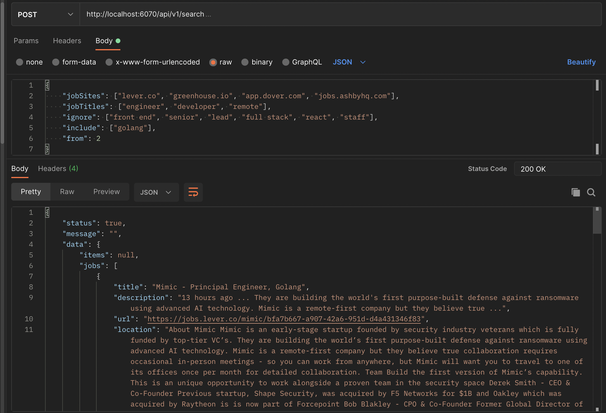

# job-search

<div align="center">
  <h3 align="center">My Job Search Tool</h3>

  <p align="center">
    Sends daily new jobs update on Telegram.
    <br />
    <a href="https://job-searcher.onrender.com">View Demo</a>
  </p>
</div>


<!-- TABLE OF CONTENTS -->
<details>
  <summary>Table of Contents</summary>
  <ol>
    <li>
      <a href="#about-the-project">About The Project</a>
      <ul>
        <li><a href="#endpoints">API Endpoints</a></li>
        <li><a href="#built-with">Built With</a></li>
      </ul>
    </li>
    <li>
      <a href="#getting-started">Getting Started</a>
      <ul>
        <li><a href="#prerequisites">Prerequisites</a></li>
        <li><a href="#installation">Installation</a></li>
      </ul>
    </li>
    <li><a href="#usage">Usage</a></li>
    <li><a href="#license">License</a></li>
  </ol>
</details>


<!-- ABOUT THE PROJECT -->
## About The Project
An API for that searches provided job sites for posted jobs.

### Given requirements 
* A user can search given job sites for posted jobs by using their urls

### Built With
* Go
* Google CSE
  


### API Swagger Docs
[https://job-searcher.onrender.com/docs](https://job-searcher.onrender.com/docs)

  
### Endpoints:

#### Search for jobs

`POST /api/v1/search`

Example request body:

```source-json
{
    "jobSites": ["lever.co", "greenhouse.io", "app.dover.com", "jobs.ashbyhq.com"],
    "jobTitles": ["engineer", "developer", "remote"],
    "ignore": ["front end", "senior", "lead", "full stack", "react", "staff"],
    "include": ["golang"],
    "from": 2
}
```

Required fields: `jobSites`, `jobTitles`, `ignore`, `include`, `from`

#### Home

`GET /`


### HTTP Response Status codes:

* 200 for OK
* 400 for Bad requests
* 500 for Internal Server Error

<p align="right">(<a href="#readme-top">back to top</a>)</p>


<!-- GETTING STARTED -->
## Getting Started

### Prerequisites

* To run this project, make sure you have Go installed on your machine.

### Installation

1. Clone the repo
   ```sh
   git clone https://github.com/rafmme/job-search.git
   ```
2. Rename the `.env.example` file to `.env` and populate the variables with the right data
   ```
      PORT=6000
      CSE_KEY=AIza
      CX=c2b
      MAIL_HOST=smtp.cvcv.com
      MAIL_HOST_USERNAME=timi@ovvv.com
      MAIL_HOST_PASSWORD=34335555
      RCV_ADDR=12345@gmail.com
      EXT_MAIL_SERVICE_URL=http://localhost:1111/api/v1/mailer
      TG_ID=12345678
      TELEGRAM_APITOKEN=68hgh9
      SERAPI_KEY=ty7799
   ```

3. Run this command ```make run``` to start up the application.

<p align="right">(<a href="#readme-top">back to top</a>)</p>


<!-- USAGE EXAMPLES -->
## Usage

<div style="text-align:center">
    
</div>

<p align="right">(<a href="#readme-top">back to top</a>)</p>

<!-- LICENSE -->
## License

Distributed under the MIT License. See `LICENSE.txt` for more information.

<p align="right">(<a href="#readme-top">back to top</a>)</p>

